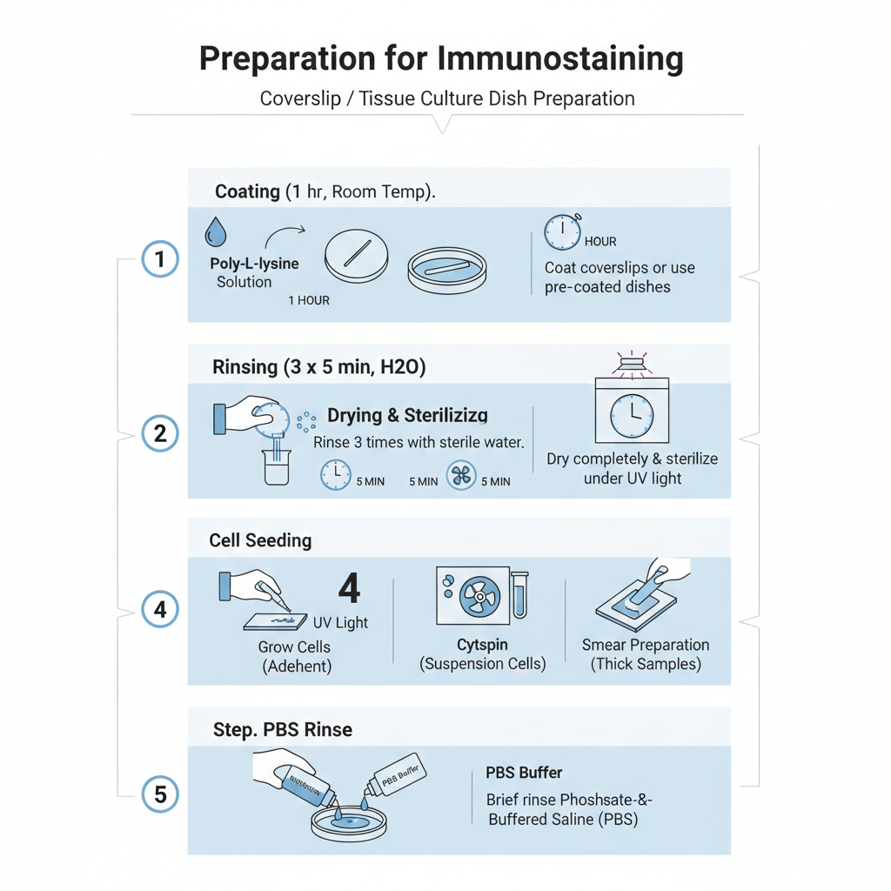
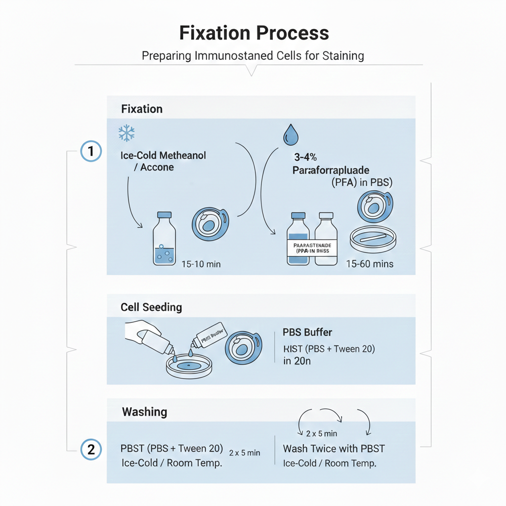
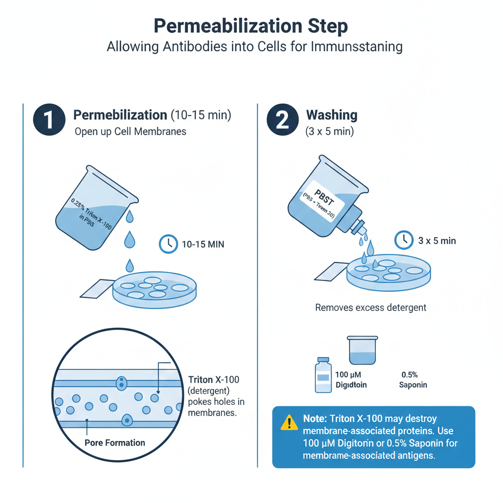
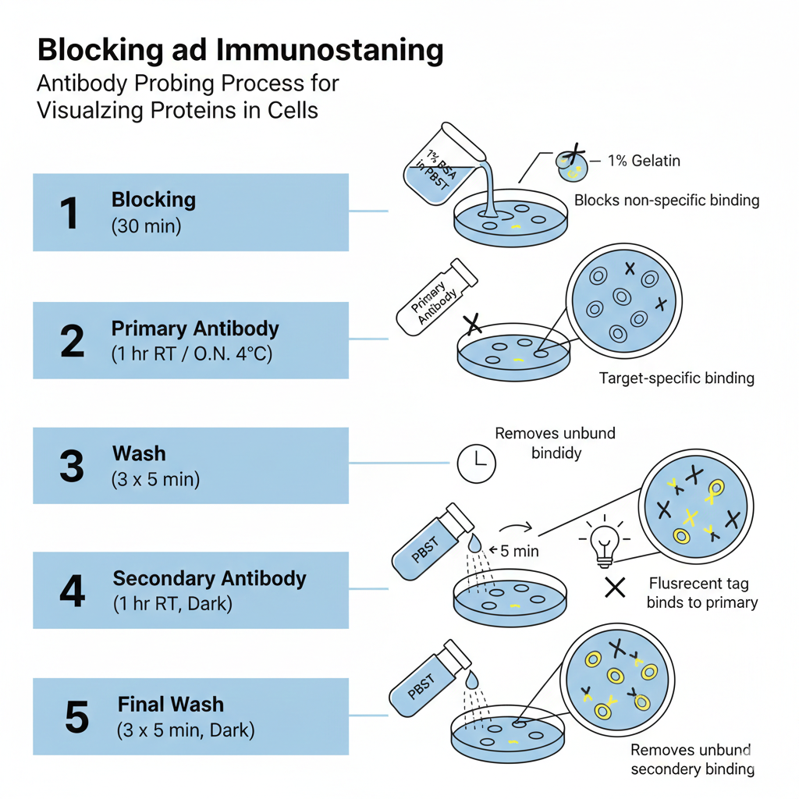
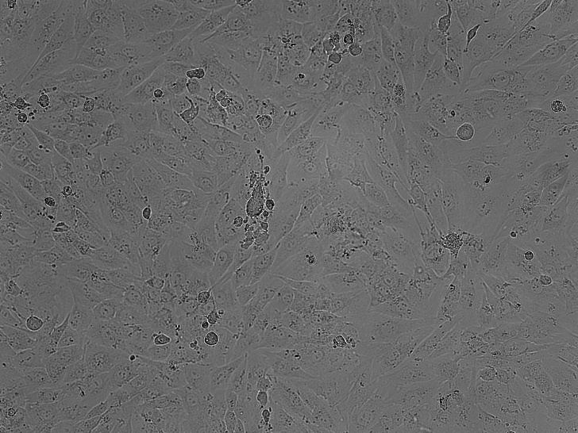
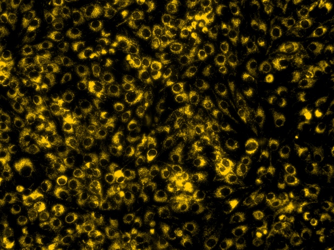

### 1. Coating

The schematic diagram to explain different steps in preparing coated coverslips is given in Figure 2. These steps are as follows:

1. Coat coverslips with polyethyleneimine or poly-L-lysine for 1 hr at room temperature or use coated tissue culture dishes.
2. Rinse coverslips well with sterile H2O (three times, 5 min each).
3. Allow coverslips to dry completely and sterilize them under UV light for at least 4 hr.
4. Grow cells on glass coverslips / tissue culture dishes or prepare cytospin or smear preparation.
5. Rinse briefly in phosphate-buffered saline (PBS).

<b>Figure 2: Steps in preparing coated coverslip for immunolocalization.</b>

### 2. Fixation

Fixation is required to stop the biological activity and movement of molecules as well as organelles in the eukaryotic cell. The schematic diagram to explain different steps in fixation of biological materials is given in Figure 3. These steps are as follows:

1. Fix the samples either in ice-cold methanol, acetone (1-10 min) or in 3-4% paraformaldehyde in PBS, pH 7.4 for 15 mins-60 mins at room temperature.
2. Wash the samples twice with ice cold / room temperature PBST (phosphate-buffered saline with Tween 20).

<b>Figure 3: Steps in fixing biological sample for immunolocalization.</b>

### 3. Permeabilization

Way for antibody to enter inside the cell. Permeabilization is required to make holes into eukaryotic cells to facilitate entry of antibody for immunolocalization of intracellular antigen. The schematic diagram to explain different steps in permeabilization of biological materials is given in Figure 4. These steps are as follows:

1. Incubate the samples for 10 mins-15 mins with PBS containing 0.25% Triton X-100 (or 100 μM digitonin or 0.5% saponin). Triton X-100 is the most popular detergent for improving the penetration of the antibody. However, it is not appropriate for membrane-associated antigens since it destroys membranes.
2. Wash cells in PBST three times for 5 min.

<b>Figure 4: Steps in permeabilization of biological sample for immunolocalization.</b>

### 4. Blocking and immunostaining

The schematic diagram to explain different steps in blocking and immunostaining are given in Figure 5. These steps are as follows:

1. Incubate cells with 1% BSA in PBST for 30 min to block unspecific binding of the antibodies (alternative blocking solutions are 1% gelatin or 10% serum from the species from which the secondary antibody was raised in).
2. Incubate cells in the diluted primary antibody in 1% BSA in PBST in a humidified chamber for 1 hr at room temperature or overnight at 4 °C.
3. Decant the solution and wash the cells three times in PBST, 5 min each wash.
4. Incubate cells with the secondary antibody in 1% BSA in PBST for 1 hr at room temperature in the dark.
5. Decant the secondary antibody solution and wash three times with PBST for 5 min each in the dark.

<b>Figure 5: Steps in blocking and immunostaining of biological sample for immunolocalization.</b>

**Mounting:** The sample is sensitive to the loss of water and needs to be preserved in a mounting media containing glycerol. In addition, fluorescence signal is sensitive to the high laser beam and it requires protection by adding antifading agent. In a typical mounting media, glycerol containing PPD (p-phenylenediamine) is used to mount fluorescent sample.

**Observation and visualization:** Sample is fixed on the microscope stage and then observed under bright light to check the cell morphology by turning the focusing knob. If the sample's morphology is good then it can be observed under fluorescence channel.

**Result:** The immunolocalized image is given in Figure 6.

<b>Figure 6: Fluorescence images after immunolocalization.</b>

