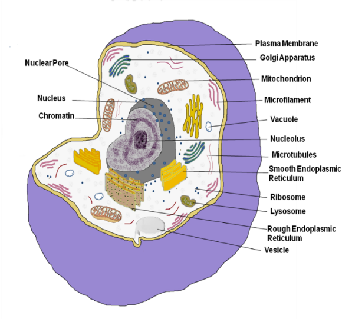
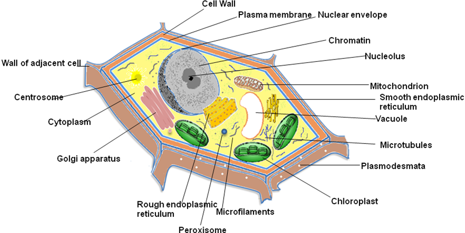

In immunolocalization high specificity of antigen-antibody binding is used to identify the exact location of marker proteins within a cell (Figure 1). By tagging these antibodies with fluorescent dyes or enzymes, we can target proteins which will become visible under a microscope, and reveal the cell's internal organization and molecular distribution. The process by which it is done is immunolabeling.

Immunolabeling is a biochemical process that enables the detection and localization of an antigen to a particular site within a cell (immunocytochemistry), tissue, or organ (immunohistochemistry). These antigens can be visualized using a combination of antigen specific antibody as well as a means of detection, called a tag, that is covalently linked to the antibody. The antibodies with fluorescent dyes can react with their antigen within a cell and allow visualization of the distribution of proteins, glycans, and small biological and nonbiological molecules. There are two complex steps in the manufacture of antibody for immunolabeling. The first (direct method) is by producing an antibody that binds specifically to the antigen of interest; here the antibody is fused to a fluorophore. Second, an indirect method employs a primary antibody that is antigen-specific and a secondary antibody fused to a fluorophore that specifically binds the primary antibody.

<b>(A)</b>

<b>(B)</b>

<b>Figure 1: Structure of Eukaryotic Cell. (A) Animal Cell (B) Plant Cell.</b>

